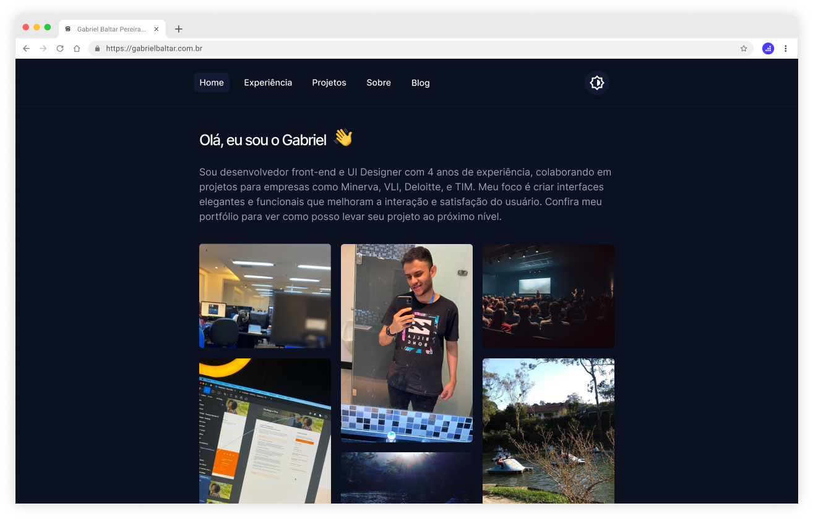

# Portfólio Gabriel Baltar Pereira

## Sobre o Projeto

Este projeto é um portfólio que apresenta meus trabalhos e experiências como desenvolvedor de software.

## Tecnologias Utilizadas

- Tecnologia 1
- Tecnologia 2
- Tecnologia 3

* [![HTML 5][HTML 5]][]
* [![React][React.js]][React-url]
* [![Vue][Vue.js]][Vue-url]

## Características

- Característica 1
- Característica 2
- Característica 3

## Como Executar o Projeto

Aqui estão as instruções de como executar o projeto...

## Contato

Seu Nome - Seu Email - Seu LinkedIn/Website

## Licença

Este projeto está sob a licença XYZ...